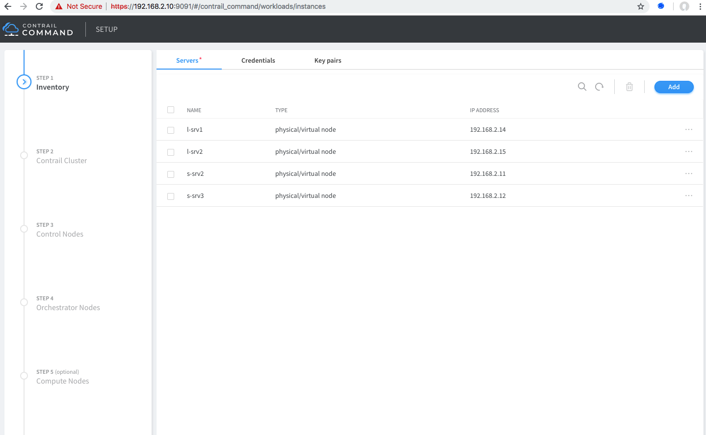
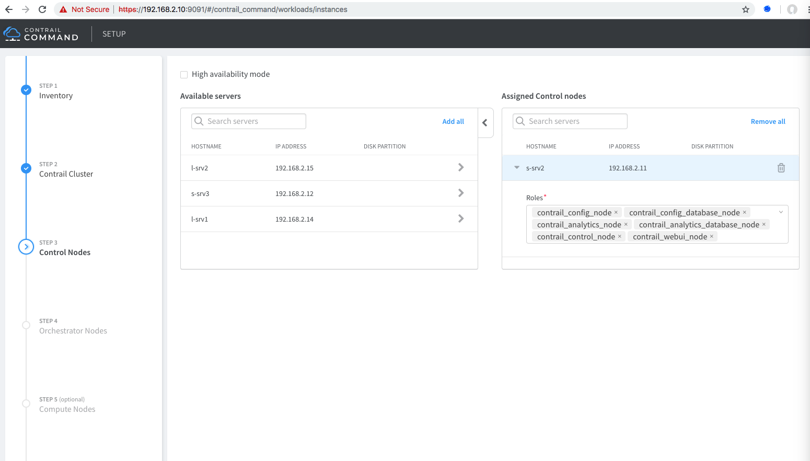
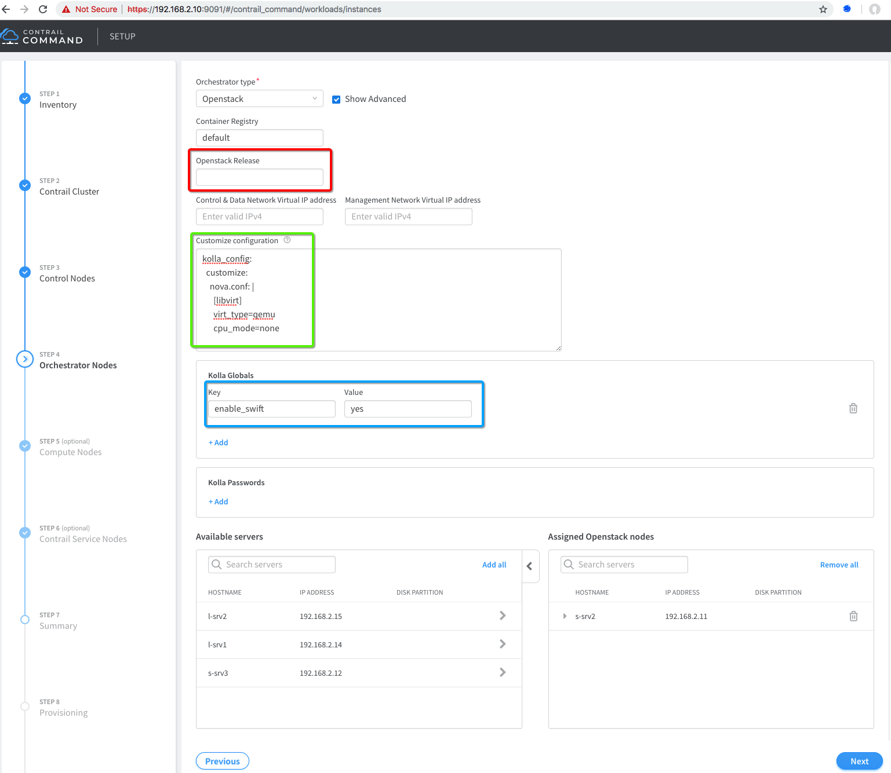
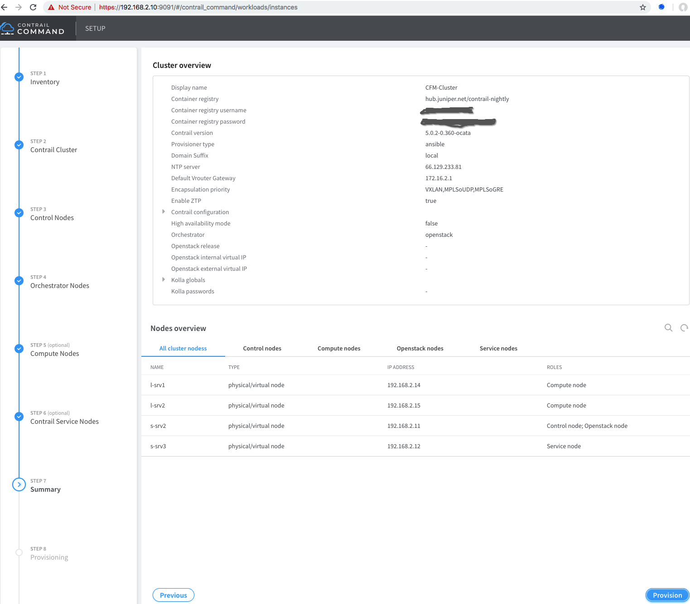
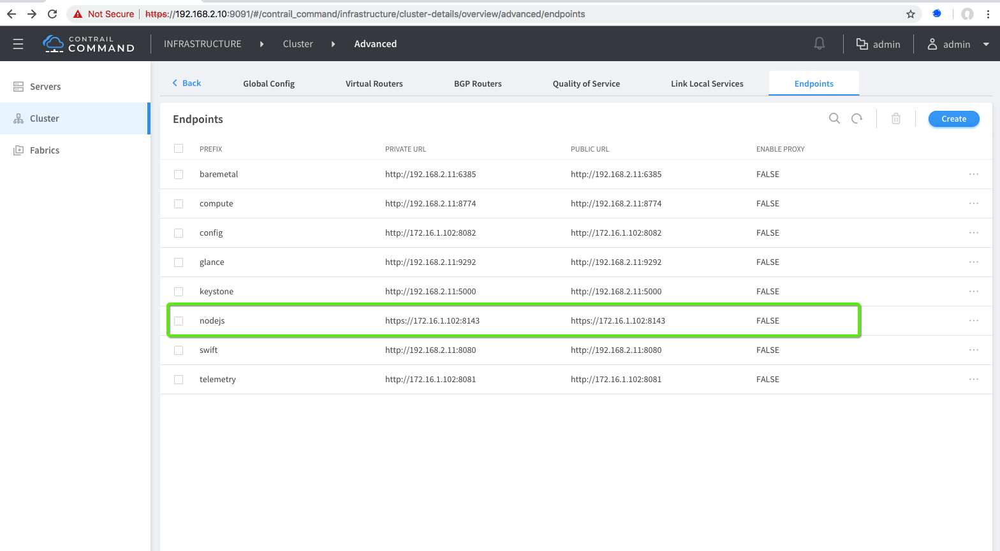
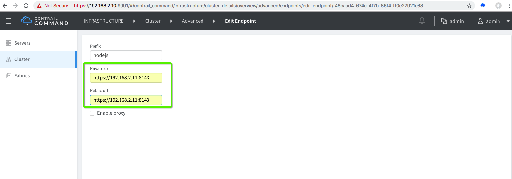
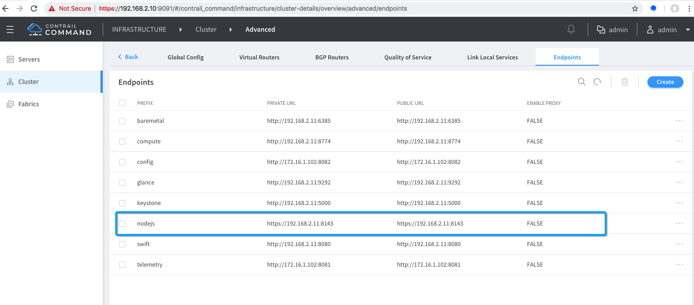

# Provisioning of OpenStack & Contrail Cluster via Contrail Command UI

***URL for Contrail Command GUI Access***   https://192.168.2.10:9091

Username/Password:   admin/contrail123

Note: Please make sure your Foxyproxy Firefox/Chrome plugin is setup before proceeding.

## 1. Add Servers

You can add servers one by one or in bulk. In case of bulk server add use following file.

### [Bulk Server Add csv file](../images/1x1-vQFX-8-Servers-Bulk.csv)


## 2. Add All Servers



## 3. Create Cluster


## 4. Add Contrail Control Node



## 5. Add OpenStack Control Node (Orchestration)



## 6. Add Compute Node


## 7. Add Contrail Service Node (Old TSN)


## 8. Cluster Summary



## 9. Cluster Provisioning Started


## 10. Check instances.yml

Contrail Command GUI creates instances.yml file used for cluster provisioning at following location "/var/tmp/contrail_cluster/***Cluster-UUID***/". Please check and review.

```bash
# Login to Contrail Command Container
docker exec -it contrail_command bash

# Autogenerated "instances.yml" file 
cat /var/tmp/contrail_cluster/a3d545fa-3fe9-4f5f-b35c-a605cb30c408/instances.yml
global_configuration:
  CONTAINER_REGISTRY: hub.juniper.net/contrail
  REGISTRY_PRIVATE_INSECURE: false
  CONTAINER_REGISTRY_USERNAME: <Username>
  CONTAINER_REGISTRY_PASSWORD: <Password>
provider_config:
  bms:
    ssh_user: root
    ssh_pwd: c0ntrail123
    ntpserver: 66.129.233.81
    domainsuffix: local
instances:
  s-srv2:
    ip: 192.168.2.11
    provider: bms
    roles:
      config:
      dhcp:
      config_database:
      control:
      webui:
      analytics:
      analytics_database:
      openstack_control:
      openstack_network:
      openstack_storage:
      openstack_monitoring:
  l-srv1:
    ip: 192.168.2.14
    provider: bms
    roles:
      vrouter:
        VROUTER_GATEWAY: 172.16.2.1
      openstack_compute:
  l-srv2:
    ip: 192.168.2.15
    provider: bms
    roles:
      vrouter:
        VROUTER_GATEWAY: 172.16.2.1
      openstack_compute:
  s-srv3:
    ip: 192.168.2.12
    provider: bms
    roles:
      vrouter:
        TSN_EVPN_MODE: true
        VROUTER_GATEWAY: 172.16.1.1
contrail_configuration:
  CONTRAIL_VERSION: 5.0.2-0.360-ocata
  CLOUD_ORCHESTRATOR: openstack
  RABBITMQ_NODE_PORT: 5673
  VROUTER_GATEWAY: 172.16.2.1
  ENCAP_PRIORITY: VXLAN,MPLSoUDP,MPLSoGRE
  AUTH_MODE: keystone
  KEYSTONE_AUTH_HOST: 192.168.2.11
  KEYSTONE_AUTH_URL_VERSION: /v3
  CONTROLLER_NODES: 172.16.1.102
  CONTROL_NODES: 172.16.1.102
  TSN_NODES: 172.16.1.103
  GENERATE_SSH: True
  USE_OPENSTACK_TFTP: True
kolla_config:
  kolla_globals:
    enable_haproxy: no
    enable_swift: yes
  kolla_passwords:
    keystone_admin_password: contrail123
  customize:
    kolla_config:
  customize:
    nova.conf: |
      [libvirt]
      virt_type=qemu
      cpu_mode=none
 ```

After successful provisioning you can login to Contrail Command UI using "admin/contrail123" and correct nodejs endpoint entry for cluster connection.

Here are the screenshots:

**Update nodejs endpoint from "https://172.16.1.102:8143 to https://192.168.2.11:8143**



Note: In Contrail Command Cluster "nodejs" should always point to Contrail UI URL which in our case is https://192.168.2.11:8143"



Correct endpoint entry:



## 11. Basic Sanity Test

After sucessful provisioning of OpenStack and Contrail Cluster lets' download basic sanity script on s-srv2 and created VM workload.

The scirpt will create two Virtual Networks and two Virtual Machines running on each compute.

VN01: 10.1.1.0/24
VN02: 20.1.1.0/24

Total Four VMs:
srv1vmvn01-01
srv1vmvn01-02
srv1vmvn02-01
srv1vmvn02-02


```bash
s-srv2> 

sudo su
wget https://raw.githubusercontent.com/qarham/cfm-vagrant/master/cfm-1x1-vqfx-7srv/scripts/basic-sanity-test.sh
wget https://raw.githubusercontent.com/qarham/cfm-vagrant/master/cfm-1x1-vqfx-7srv/scripts/create-workload.sh
wget https://raw.githubusercontent.com/qarham/cfm-vagrant/master/cfm-1x1-vqfx-7srv/scripts/delete-workload.sh
wget https://raw.githubusercontent.com/qarham/cfm-vagrant/master/cfm-1x1-vqfx-7srv/scripts/install-os-clinet-images.sh

chmod +x basic-sanity-test.sh create-workload.sh install-os-clinet-images.sh delete-workload.sh

# Let's run basic sanity script
./basic-sanity-test.sh

 ```

## 13. Basic Sanity Check (Not required for workshop)

To make sure Cluster provisioning is successful and no issue let's create some work load using a simple basic sanity script "basic-sanity-test.sh".

This script will perform following actions:
* install OpenStack client 
* Download and Add cirros images
* Create VM flavors
* Create TWO VNs VN01: 10.1.1.0/24 & VN02: 20.1.1.0/24
* Instantiate two VMs in each VN (VN01 & VN02)

```bash
wget https://raw.githubusercontent.com/qarham/cfm-vagrant/master/cfm-1x1-vqfx-7srv/scripts/basic-sanity-test.sh

chmod +x basic-sanity-test.sh

./basic-sanity-test.sh

 ```

## Other Tips

In case provisioning fail for OpenSTack/Contrail install and you would like to run ansible provisioning manually you can use following commands.

```bash
cd /usr/share/contrail/contrail-ansible-deployer

# For manual OpenStack Installation use following command
ansible-playbook -i inventory/ -e orchestrator=openstack -e config_file=/var/tmp/contrail_cluster/<Cluseter-UUID>/instances.yml playbooks/install_openstack.yml 

# For manual Contrail Installation use following command
ansible-playbook -i inventory/ -e orchestrator=openstack -e config_file=/var/tmp/contrail_cluster/<Cluseter-UUID>/instances.yml playbooks/install_contrail.yml
 ```

To reset OpenStack Kola use following command:

Login to contrail_command container and follow the steps:

```bash
docker exec -it contrail_command bash
cd /usr/share/contrail/contrail-kolla-ansible
./tools/kolla-ansible -i ansible/inventory/my_inventory --configdir etc/kolla --passwords etc/kolla/passwords.yml destroy --yes-i-really-really-mean-it
 ```

### References

* <https://github.com/Juniper/contrail-ansible-deployer/wiki>
* https://github.com/Juniper/contrail-command-deployer/wiki/Using-Ansible-to-launch-the-Contrail-Command-Containers
* <https://github.com/Juniper/vqfx10k-vagrant>